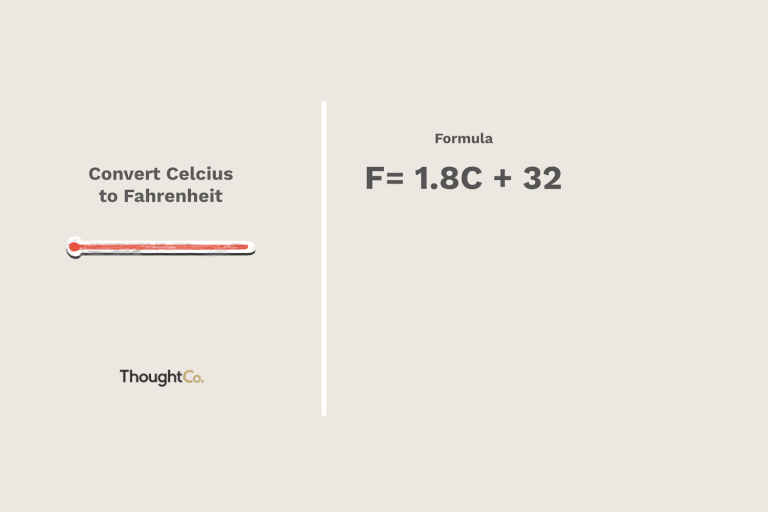

### 
Temperature Conversion

    
    &nbsp;&nbsp;
    

  

The Temperature Conversion Application is a simple application comprised of loop labels,&nbsp;enums,&nbsp;functions,&nbsp;a closure,&nbsp;and implementations of traits.&nbsp;&nbsp;Once the program is started,&nbsp;the user is asked to enter a 'C' for conversion from Celsius to Fahrenheit or 'F' to convert from Fahrenheit to Celsius,&nbsp;even though,&nbsp;the program is additionally designed to allow a user to input 'Celsius' or 'Fahrenheit'.&nbsp;&nbsp;The program then asks that a number be entered for the temperature to be converted.&nbsp;&nbsp;The number can either be of type integer or float.&nbsp;&nbsp;At each stage of the previous steps, the user is given the option to exit the program by typing 'quit'.&nbsp;&nbsp;Any error in entering the requested type for either step will simply rerun that particular step.&nbsp;&nbsp;The flowchart for this program can be viewed below.
  
<pre class="mermaid">
flowchart LR
A[Start Program] -->B{Quit or  enter temperature scale}
B -- Temperature Scale --> C{Quit or enter temperature number} 
C -- Temperature Number --> D[Temperature successfully converted!] 
D -- Start Again -->B
B -- Quit --> E[Stop Program]
C -- Quit --> E
 </pre>

 
Thank you for reading about this application.&nbsp;&nbsp;Click 'Star' if you like the program and do reach out and let me know if you have any questions or concerns.&nbsp;&nbsp;All suggestions, constructive,&nbsp;even non-constructive,&nbsp;will be welcomed.&nbsp;The source code can be viewed by first clicking on the&nbsp; [src](https://github.com/nagashi/Temperature-Conversion/tree/main/src)&nbsp;folder,&nbsp;and then clicking on the&nbsp; [main.rs](https://github.com/nagashi/Temperature-Conversion/blob/main/src/main.rs)&nbsp;file,&nbsp;for those unfamiliar with the Rust language.        
         

 

[![MIT licensed][mit-badge]][mit-url]&nbsp;&nbsp; Rust 🦀 v1.59.0

 
 

### License

This project is licensed under the&nbsp; [MIT license](LICENSE).

[mit-badge]: https://img.shields.io/badge/license-MIT-blue.svg
[mit-url]: LICENSE
### Contribution

Unless you explicitly state otherwise,&nbsp;any contribution intentionally submitted
for inclusion in&nbsp; 'Temperature_Conversion'&nbsp;by you,&nbsp;shall be licensed as MIT,&nbsp;without any additional terms or conditions.

