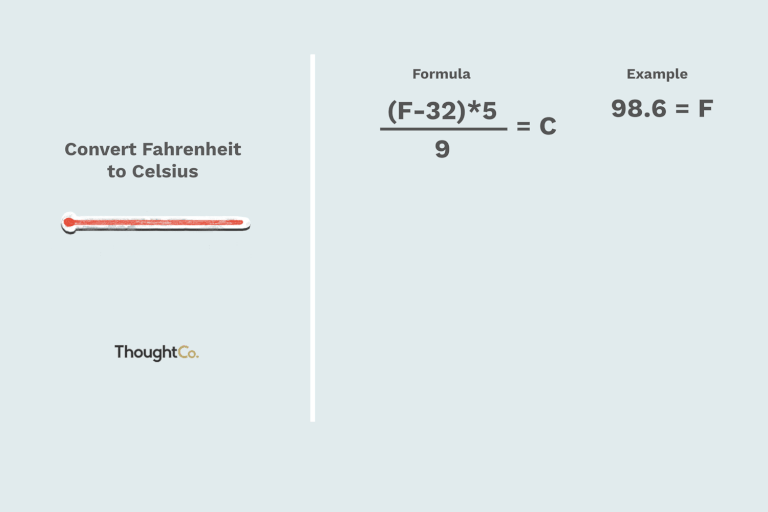

### 
Temperature Conversion

    
    &nbsp;&nbsp;
    

&nbsp;&nbsp;
Temperature Conversion Application
When ran, you're asked to enter a c for conversion from Celsius to Fahrenheit or f to convert from Fahrenheit to Celsius. You'll then be asked to enter an integer as the temperature you wish to convert.

This README would normally document whatever steps are necessary to get the
application up and running.

Things you may want to cover:

* Language: Rust 🦀 v1.58.1

* System dependencies: None

* Configuration

* Database creation

* Database initialization

* How to run the test suite

* Services (job queues, cache servers, search engines, etc.)

* Deployment instructions

* ...
